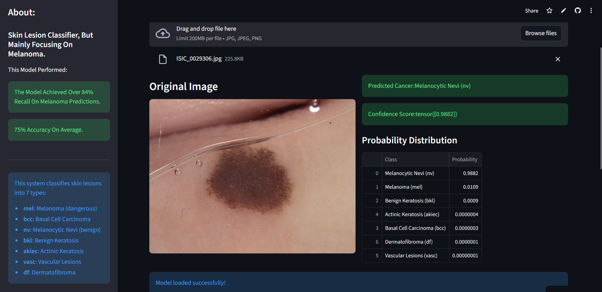

# Skin Lesion Classifier

Live Demo: https://ham10000-skin-lesion-classification.streamlit.app/

Dataset
This project uses the HAM10000 dataset containing 10,015 dermatoscopic images across 7 skin lesion classes.
Data was split into 70% training, 15% validation, and 15% testing.

AI-powered skin lesion classification using deep learning, achieving 84% recall on melanoma detection.

## Features
- ResNet18-based classifier trained on HAM10000 dataset
- Grad-CAM visualization for model interpretability
- 7-class classification (melanoma, nevus, basal cell carcinoma, etc.)
- 75% overall accuracy, 84% melanoma recall

## Tech Stack
Python, PyTorch, Streamlit, OpenCV

## Technical Details
Training
- "Model - "ResNet18(Trained On ImageNet)"
- "Loss - CrossEntropyLoss"
- "Optimizer - AdamW"
- "Epochs - 25"
- "Learning Rate - 0.003 to 0.001"

              precision    recall  f1-score   support

          nv       0.97      0.72      0.83      1006
         mel       0.33      0.86      0.48       167
         bkl       0.66      0.65      0.65       165
         bcc       0.71      0.83      0.77        77
       akiec       0.64      0.37      0.47        49
        vasc       0.73      0.86      0.79        22
          df       0.58      0.65      0.61        17

    accuracy                           0.72      1503
   macro avg       0.66      0.70      0.66      1503
weighted avg       0.83      0.72      0.75      1503

  

  

## Installation

git clone https://github.com/vnithin9632-ux/ham10000-skin-lesion-classification.git
cd project
pip install -r requirements.txt

## For Running The App Locally
streamlit run app.py

## Usage
Upload a skin lesion image to get instant classification with confidence scores and attention heatmap.

#### Limitations

- "Performance may drop on non-dermoscopic images"
- "Dataset imbalance affects minority classes"
- "Not intended for clinical diagnosis"

#### ⚠️ This tool is for educational purposes only and not for medical diagnosis.